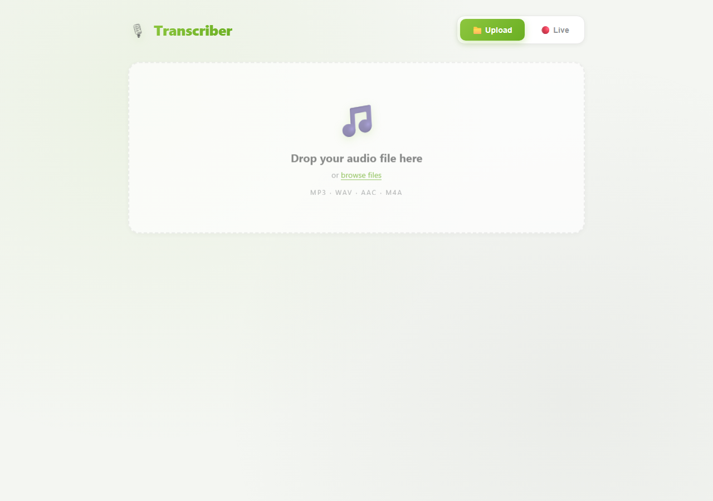

# Audio/Video Transcriber + Highlight

A Flask web app that transcribes **audio and video** recordings to text using
[faster-whisper](https://github.com/SYSTRAN/faster-whisper), with **word-level
timestamps** and a synced highlight — the words light up as the audio plays.
Handles mixed **Arabic + English** speech. Built for a translation office that
transcribes calls and recordings.

## Screenshot



## Features

- **Speech → text** for common audio/video formats (via ffmpeg).
- **Word-level timestamps** with karaoke-style highlighting during playback.
- **Arabic + English** in the same recording.
- **Runs locally** — recordings never leave your machine, no cloud API.

## Requirements

- Python 3.9+
- **ffmpeg / ffprobe** on `PATH` (audio decoding)
- Python packages in [`requirements.txt`](requirements.txt)
- A faster-whisper model (see below)

### 1. Install ffmpeg

- **Windows:** `winget install Gyan.FFmpeg` (or download from ffmpeg.org)
- **macOS:** `brew install ffmpeg`
- **Linux:** `sudo apt install ffmpeg`

### 2. Get the model

The speech model (~3 GB for large-v2) is **not** in this repo. Download it once:

```bash
pip install -r requirements.txt
python scripts/download_model.py      # fetches large-v2 into models/large-v2
```

Prefer a lighter/faster model? Skip the download and just set an env var — it
auto-downloads on first run:

```bash
WHISPER_MODEL=small python app.py     # or medium / base
```

## Run

```bash
python app.py
```

Open **http://127.0.0.1:5004**, upload a recording, watch the transcript build
with synced highlighting.

### Options (env vars)

| Variable | Default | Notes |
|----------|---------|-------|
| `WHISPER_MODEL` | `models/large-v2` | model name or local path |
| `WHISPER_DEVICE` | `cpu` | set `cuda` for GPU |
| `WHISPER_COMPUTE` | `int8` | e.g. `float16` on GPU |
| `PORT` | `5004` | server port |

## License

MIT
